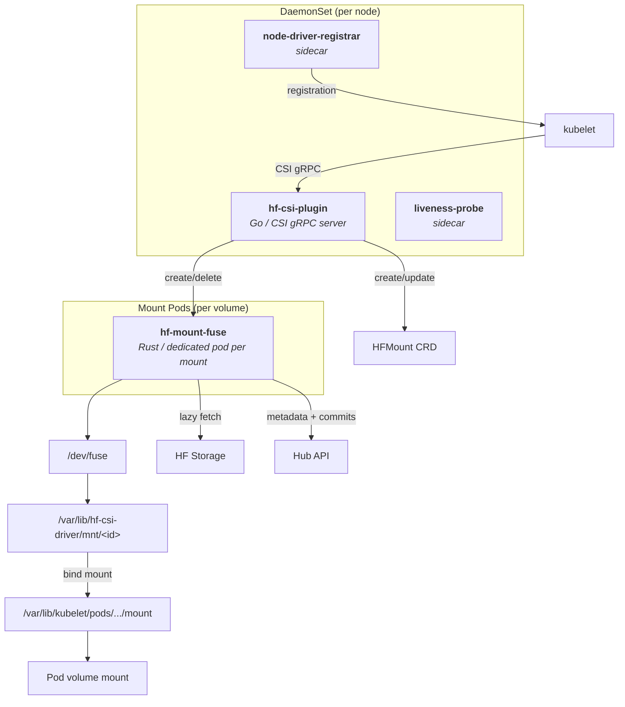

# hf-csi-driver

Kubernetes CSI driver for mounting [Hugging Face Buckets](https://huggingface.co/docs/hub/storage-buckets) and model/dataset repos as FUSE volumes in pods.

Wraps [hf-mount](https://github.com/huggingface/hf-mount) (Rust FUSE filesystem) behind the CSI interface so kubelet can manage mount lifecycle automatically.

## How it works

```
Pod -> kubelet -> CSI NodePublishVolume -> mount pod (hf-mount-fuse) -> FUSE mount -> bind mount to target
                  CSI NodeUnpublishVolume -> unmount bind + delete mount pod
```

- **Pod-based mounting**: each FUSE mount runs in a dedicated Kubernetes pod that survives CSI driver restarts
- **Self-healing**: mount pods are automatically recreated from CRD state if they crash
- **HFMount CRD**: tracks mount state (args, workloads, targets) as the source of truth
- **Static provisioning**: users create PV/PVC pairs pointing to a bucket or repo
- **HF token**: passed via Kubernetes Secret through `nodePublishSecretRef`, refreshed live via `requiresRepublish`
- **Mount flags passthrough**: PV `mountOptions` are forwarded as `--flag` arguments to hf-mount-fuse

## Prerequisites

- Kubernetes 1.26+
- FUSE support on nodes (`/dev/fuse` available, `fuse3` installed)
- The CSI driver and mount pod containers run as `privileged` (required for FUSE + mount propagation)

## Installation

### Helm (recommended)

```bash
helm install hf-csi oci://ghcr.io/huggingface/charts/hf-csi-driver \
  --namespace kube-system
```

Or from a local checkout:

```bash
helm install hf-csi deploy/helm/hf-csi-driver/ \
  --namespace kube-system
```

### Plain manifests

```bash
kubectl apply -f deploy/kubernetes/serviceaccount.yaml
kubectl apply -f deploy/kubernetes/csidriver.yaml
kubectl apply -f deploy/kubernetes/rbac.yaml
kubectl apply -f deploy/kubernetes/crd.yaml
kubectl apply -f deploy/kubernetes/daemonset.yaml
```

## Usage

### 1. Create a Secret with your HF token

```bash
kubectl create secret generic hf-token --from-literal=token=hf_xxxxx
```

### 2. Ephemeral volume (simplest)

No PV/PVC needed. The volume is created inline in the Pod spec and destroyed with the pod.

```yaml
apiVersion: v1
kind: Pod
metadata:
  name: my-app
spec:
  containers:
    - name: app
      image: python:3.12
      command: ["python", "-c", "import os; print(os.listdir('/model'))"]
      volumeMounts:
        - name: gpt2
          mountPath: /model
          readOnly: true
  volumes:
    - name: gpt2
      csi:
        driver: hf.csi.huggingface.co
        readOnly: true
        volumeAttributes:
          sourceType: repo
          sourceId: openai-community/gpt2
        nodePublishSecretRef:
          name: hf-token
```

### 3. Mount a bucket (read-write, PV/PVC)

```yaml
apiVersion: v1
kind: PersistentVolume
metadata:
  name: my-bucket-pv
spec:
  capacity:
    storage: 1Ti  # ignored by CSI, required by k8s
  accessModes: [ReadWriteMany]
  persistentVolumeReclaimPolicy: Retain
  storageClassName: ""
  csi:
    driver: hf.csi.huggingface.co
    volumeHandle: my-bucket
    nodePublishSecretRef:
      name: hf-token
      namespace: default
    volumeAttributes:
      sourceType: bucket
      sourceId: username/my-bucket
---
apiVersion: v1
kind: PersistentVolumeClaim
metadata:
  name: my-bucket-pvc
spec:
  accessModes: [ReadWriteMany]
  storageClassName: ""
  resources:
    requests:
      storage: 1Ti
  volumeName: my-bucket-pv
```

### 4. Mount a model repo (read-only, PV/PVC)

```yaml
apiVersion: v1
kind: PersistentVolume
metadata:
  name: gpt2-pv
spec:
  capacity:
    storage: 1Ti
  accessModes: [ReadOnlyMany]
  persistentVolumeReclaimPolicy: Retain
  storageClassName: ""
  mountOptions:
    - read-only
  csi:
    driver: hf.csi.huggingface.co
    volumeHandle: gpt2
    nodePublishSecretRef:
      name: hf-token
      namespace: default
    volumeAttributes:
      sourceType: repo
      sourceId: openai-community/gpt2
      revision: main
---
apiVersion: v1
kind: PersistentVolumeClaim
metadata:
  name: gpt2-pvc
spec:
  accessModes: [ReadOnlyMany]
  storageClassName: ""
  resources:
    requests:
      storage: 1Ti
  volumeName: gpt2-pv
```

### 5. Use in a pod

```yaml
apiVersion: v1
kind: Pod
metadata:
  name: my-app
spec:
  containers:
    - name: app
      image: python:3.12
      command: ["python", "-c", "import os; print(os.listdir('/data'))"]
      volumeMounts:
        - name: hf-data
          mountPath: /data
          readOnly: true
  volumes:
    - name: hf-data
      persistentVolumeClaim:
        claimName: gpt2-pvc
```

## Volume attributes

Configured in `volumeAttributes` of the PV's CSI section:

| Attribute | Required | Default | Description |
| --- | --- | --- | --- |
| `sourceType` | yes | | `bucket` or `repo` |
| `sourceId` | yes | | HF identifier (e.g. `username/my-bucket`, `openai-community/gpt2`) |
| `revision` | no | `main` | Git revision (repos only) |
| `hubEndpoint` | no | `https://huggingface.co` | Hub API endpoint |
| `cacheDir` | no | auto | Local cache directory for this volume |
| `cacheSize` | no | `10000000000` | Max cache size in bytes |
| `pollIntervalSecs` | no | `30` | Remote change polling interval |
| `metadataTtlMs` | no | `10000` | Kernel metadata cache TTL in milliseconds |
| `tokenKey` | no | `token` | Key in the Secret to use as the HF token |
| `mountFlags` | no | | Comma-separated hf-mount flags for inline ephemeral volumes (e.g. `advanced-writes,uid=1000`) |
| `memoryLimit` | no | | Memory limit for the injected `hf-mount` sidecar (e.g. `2Gi`). Requires the admission webhook. |
| `memoryRequest` | no | `32Mi` | Memory request for the injected `hf-mount` sidecar (e.g. `128Mi`). Requires the admission webhook. |
| `cpuLimit` | no | | CPU limit for the injected `hf-mount` sidecar (e.g. `1`, `500m`). Requires the admission webhook. |
| `cpuRequest` | no | `10m` | CPU request for the injected `hf-mount` sidecar (e.g. `100m`). Requires the admission webhook. |

### Sidecar resources

When the admission webhook is enabled, the `hf-mount` FUSE sidecar is injected
into every pod using an HF CSI volume. By default it ships with modest
requests (`cpu: 10m`, `memory: 32Mi`) and **no limits**, which can let the
cache grow unbounded and trigger node memory pressure under heavy traffic. Use
the `memoryLimit` / `memoryRequest` / `cpuLimit` / `cpuRequest`
`volumeAttributes` to cap it — values are standard Kubernetes quantity strings
(e.g. `"2Gi"`, `"500m"`).

```yaml
volumes:
  - name: hf-data
    csi:
      driver: hf.csi.huggingface.co
      volumeAttributes:
        sourceType: bucket
        sourceId: username/my-bucket
        memoryLimit: 2Gi
        memoryRequest: 256Mi
```

The sidecar is a single container shared across every HF CSI volume in the
pod. If multiple volumes set the same resource attribute with different
values, the first volume (in `pod.spec.volumes` order) wins; invalid quantity
strings are logged and ignored so a typo never blocks pod admission.

## Mount options

PV `mountOptions` are forwarded as CLI flags to hf-mount-fuse. For example:

```yaml
mountOptions:
  - read-only
  - uid=1000
  - gid=1000
  - advanced-writes
```

For inline ephemeral volumes (where `mountOptions` is not available in the CSI volume spec), use the `mountFlags` volume attribute instead:

```yaml
volumeAttributes:
  sourceType: bucket
  sourceId: username/my-bucket
  mountFlags: "advanced-writes,uid=1000"
```

## Building

```bash
# Docker image (multi-stage: Rust + Go)
make docker-build

# Go binary only
make build

# Tests
make test
```

## Architecture



## License

Apache-2.0
