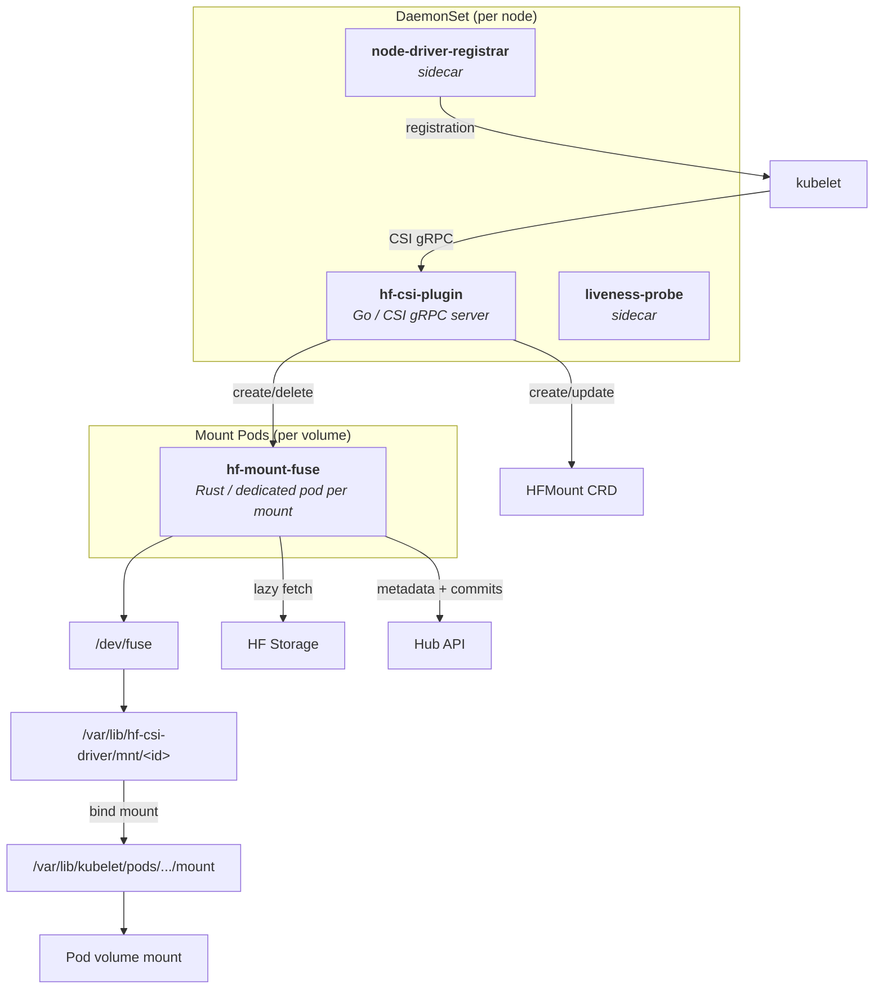

# hf-csi-driver

Kubernetes CSI driver for mounting [Hugging Face Buckets](https://huggingface.co/docs/hub/storage-buckets) and model/dataset repos as FUSE volumes in pods.

Wraps [hf-mount](https://github.com/huggingface/hf-mount) (Rust FUSE filesystem) behind the CSI interface so kubelet can manage mount lifecycle automatically.

## How it works

```
Pod -> kubelet -> CSI NodePublishVolume -> mount pod (hf-mount-fuse) -> FUSE mount -> bind mount to target
                  CSI NodeUnpublishVolume -> unmount bind + delete mount pod
```

- **Pod-based mounting**: each FUSE mount runs in a dedicated Kubernetes pod that survives CSI driver restarts
- **Self-healing**: mount pods are automatically recreated from CRD state if they crash
- **HFMount CRD**: tracks mount state (args, workloads, targets) as the source of truth
- **Static provisioning**: users create PV/PVC pairs pointing to a bucket or repo
- **HF token**: passed via Kubernetes Secret through `nodePublishSecretRef`, refreshed live via `requiresRepublish`
- **Mount flags passthrough**: PV `mountOptions` are forwarded as `--flag` arguments to hf-mount-fuse
- **Graceful unmount (sidecar mode)**: the sidecar unpublish path aborts the FUSE connection (`/sys/fs/fuse/connections/<minor>/abort`, minor resolved from `/proc/self/mountinfo` — never a blocking `stat`) before `MNT_DETACH`. If the in-pod FUSE daemon wedged (a thread stuck in an uninterruptible `inval_inode` writev), `MNT_DETACH` alone would leave it un-reapable and the pod stuck `Terminating`; aborting errors out the in-kernel waiter so the pod can finalize. The abort is scoped to the direct sidecar mount only — never bind-mount references, which share the source connection.
- **Stuck-volume reconciler**: a node-plugin sweep repairs CSI volume dirs that are missing kubelet's `vol_data.json` — left behind by pods deleted mid-init — which otherwise wedge kubelet's `UnmountVolume` retry loop forever. Ownership is verified against **live pod specs** (only inline CSI volumes whose driver is this one), never inferred from directory names, and a stale-age + `O_EXCL` write avoid racing an in-progress publish. Scans `<--kubelet-root>/pods` (default `/var/lib/kubelet`).
- **Orphaned-connection sweep**: the unpublish-time abort above only fires on the normal teardown path. When a connection is *already* orphaned — the serving hf-mount daemon is a zombie/gone and no `NodeUnpublishVolume` is in flight — a periodic node sweep (`--fuse-sweep-interval`, default `60s`) aborts it. Without this, the dead FUSE superblock wedges its own `umount` (stuck in `fuse_kill_sb_anon`) **and** any node-wide `sync(2)` that walks all superblocks — stranding *unrelated* pods on the node in `Terminating` (see [Node-layer hardening](#node-layer-hardening) below). The sweep is strictly scoped: it only ever touches our FUSE mounts (mount source `hf-mount` or under the driver's source dir) and aborts a connection only when `waiting > 0`, sustained across two sweeps, **and** no live process is serving the mount (positive proof of life — the daemon's argv carries the volume ID, or its cgroup carries the workload pod UID, and it holds an open `/dev/fuse` fd). Requires `hostPID` so the plugin can see node processes. Disable with `--fuse-sweep-enabled=false` (also drop `hostPID`).

## Prerequisites

- Kubernetes 1.26+
- FUSE support on nodes (`/dev/fuse` available, `fuse3` installed)
- The CSI driver and mount pod containers run as `privileged` (required for FUSE + mount propagation)
- The node DaemonSet runs with `hostPID: true` (required by the orphaned-connection sweep to inspect node processes; set `fuseSweep.enabled=false` and `hostPID=false` together to opt out)

## Installation

### Helm (recommended)

```bash
helm install hf-csi oci://ghcr.io/huggingface/charts/hf-csi-driver \
  --namespace kube-system
```

Or from a local checkout:

```bash
helm install hf-csi deploy/helm/hf-csi-driver/ \
  --namespace kube-system
```

### Plain manifests

```bash
kubectl apply -f deploy/kubernetes/serviceaccount.yaml
kubectl apply -f deploy/kubernetes/csidriver.yaml
kubectl apply -f deploy/kubernetes/rbac.yaml
kubectl apply -f deploy/kubernetes/crd.yaml
kubectl apply -f deploy/kubernetes/daemonset.yaml
```

## Usage

### 1. Create a Secret with your HF token

```bash
kubectl create secret generic hf-token --from-literal=token=hf_xxxxx
```

### 2. Ephemeral volume (simplest)

No PV/PVC needed. The volume is created inline in the Pod spec and destroyed with the pod.

```yaml
apiVersion: v1
kind: Pod
metadata:
  name: my-app
spec:
  containers:
    - name: app
      image: python:3.12
      command: ["python", "-c", "import os; print(os.listdir('/model'))"]
      volumeMounts:
        - name: gpt2
          mountPath: /model
          readOnly: true
  volumes:
    - name: gpt2
      csi:
        driver: hf.csi.huggingface.co
        readOnly: true
        volumeAttributes:
          sourceType: repo
          sourceId: openai-community/gpt2
        nodePublishSecretRef:
          name: hf-token
```

### 3. Mount a bucket (read-write, PV/PVC)

```yaml
apiVersion: v1
kind: PersistentVolume
metadata:
  name: my-bucket-pv
spec:
  capacity:
    storage: 1Ti  # ignored by CSI, required by k8s
  accessModes: [ReadWriteMany]
  persistentVolumeReclaimPolicy: Retain
  storageClassName: ""
  csi:
    driver: hf.csi.huggingface.co
    volumeHandle: my-bucket
    nodePublishSecretRef:
      name: hf-token
      namespace: default
    volumeAttributes:
      sourceType: bucket
      sourceId: username/my-bucket
---
apiVersion: v1
kind: PersistentVolumeClaim
metadata:
  name: my-bucket-pvc
spec:
  accessModes: [ReadWriteMany]
  storageClassName: ""
  resources:
    requests:
      storage: 1Ti
  volumeName: my-bucket-pv
```

### 4. Mount a model repo (read-only, PV/PVC)

```yaml
apiVersion: v1
kind: PersistentVolume
metadata:
  name: gpt2-pv
spec:
  capacity:
    storage: 1Ti
  accessModes: [ReadOnlyMany]
  persistentVolumeReclaimPolicy: Retain
  storageClassName: ""
  mountOptions:
    - read-only
  csi:
    driver: hf.csi.huggingface.co
    volumeHandle: gpt2
    nodePublishSecretRef:
      name: hf-token
      namespace: default
    volumeAttributes:
      sourceType: repo
      sourceId: openai-community/gpt2
      revision: main
---
apiVersion: v1
kind: PersistentVolumeClaim
metadata:
  name: gpt2-pvc
spec:
  accessModes: [ReadOnlyMany]
  storageClassName: ""
  resources:
    requests:
      storage: 1Ti
  volumeName: gpt2-pv
```

### 5. Use in a pod

```yaml
apiVersion: v1
kind: Pod
metadata:
  name: my-app
spec:
  containers:
    - name: app
      image: python:3.12
      command: ["python", "-c", "import os; print(os.listdir('/data'))"]
      volumeMounts:
        - name: hf-data
          mountPath: /data
          readOnly: true
  volumes:
    - name: hf-data
      persistentVolumeClaim:
        claimName: gpt2-pvc
```

## Volume attributes

Configured in `volumeAttributes` of the PV's CSI section:

| Attribute | Required | Default | Description |
| --- | --- | --- | --- |
| `sourceType` | yes | | `bucket` or `repo` |
| `sourceId` | yes | | HF identifier (e.g. `username/my-bucket`, `openai-community/gpt2`) |
| `revision` | no | `main` | Git revision (repos only) |
| `hubEndpoint` | no | `https://huggingface.co` | Hub API endpoint |
| `cacheDir` | no | auto | Local cache directory for this volume |
| `cacheSize` | no | `10000000000` | Max cache size in bytes |
| `pollIntervalSecs` | no | `30` | Remote change polling interval |
| `pollListingConcurrency` | no | `4` | Maximum concurrent `/api/.../tree` requests per poll round. Lower it (e.g. `2`) in shared environments (e.g. Spaces) where many mounts poll the same upstream, to reduce pressure on the Hub `/api` endpoint. Must be >= 1. |
| `metadataTtlMs` | no | `10000` | Kernel metadata cache TTL in milliseconds |
| `inodeSoftLimit` | no | `0` | Soft cap on in-memory inode table size (0 disables). When exceeded, `hf-mount` evicts the oldest untouched entries before inserting new ones, putting backpressure on the workload instead of letting the sidecar OOM. |
| `lruSweepIntervalMs` | no | `5000` | Interval between background LRU sweeps that ask the kernel to drop dentries whose inode still has positive refcount. Only consulted when `inodeSoftLimit > 0`. |
| `tokenKey` | no | `token` | Key in the Secret to use as the HF token |
| `mountFlags` | no | | Comma-separated hf-mount flags for inline ephemeral volumes (e.g. `advanced-writes,uid=1000`) |
| `memoryLimit` | no | | Memory limit for the injected `hf-mount` sidecar (e.g. `2Gi`). Requires the admission webhook. |
| `memoryRequest` | no | `32Mi` | Memory request for the injected `hf-mount` sidecar (e.g. `128Mi`). Requires the admission webhook. |
| `cpuLimit` | no | | CPU limit for the injected `hf-mount` sidecar (e.g. `1`, `500m`). Requires the admission webhook. |
| `cpuRequest` | no | `10m` | CPU request for the injected `hf-mount` sidecar (e.g. `100m`). Requires the admission webhook. |

### Sidecar resources

When the admission webhook is enabled, the `hf-mount` FUSE sidecar is injected
into every pod using an HF CSI volume. By default it ships with modest
requests (`cpu: 10m`, `memory: 32Mi`) and **no limits**, which can let the
cache grow unbounded and trigger node memory pressure under heavy traffic. Use
the `memoryLimit` / `memoryRequest` / `cpuLimit` / `cpuRequest`
`volumeAttributes` to cap it — values are standard Kubernetes quantity strings
(e.g. `"2Gi"`, `"500m"`).

```yaml
volumes:
  - name: hf-data
    csi:
      driver: hf.csi.huggingface.co
      volumeAttributes:
        sourceType: bucket
        sourceId: username/my-bucket
        memoryLimit: 2Gi
        memoryRequest: 256Mi
```

The sidecar is a single container shared across every HF CSI volume in the
pod. If multiple volumes set the same resource attribute with different
values, the first volume (in `pod.spec.volumes` order) wins; invalid quantity
strings are logged and ignored so a typo never blocks pod admission.

## Mount options

PV `mountOptions` are forwarded as CLI flags to hf-mount-fuse. For example:

```yaml
mountOptions:
  - read-only
  - uid=1000
  - gid=1000
  - advanced-writes
```

For inline ephemeral volumes (where `mountOptions` is not available in the CSI volume spec), use the `mountFlags` volume attribute instead:

```yaml
volumeAttributes:
  sourceType: bucket
  sourceId: username/my-bucket
  mountFlags: "advanced-writes,uid=1000"
```

## Building

```bash
# Docker image (multi-stage: Rust + Go)
make docker-build

# Go binary only
make build

# Tests
make test
```

## Startup taint (fresh nodes)

On a freshly-launched node the driver registers with kubelet 35–80 s after the node becomes
schedulable; any pod with an HF volume scheduled in that window gets `FailedMount: driver name
hf.csi.huggingface.co not found`. To close the window, taint nodes at registration and let the
driver lift the taint once it is ready (the same pattern as `ebs.csi.aws.com/agent-not-ready`):

1. Have node bootstrap add `hf.csi.huggingface.co/agent-not-ready:NoSchedule` — kubelet
   `registerWithTaints` in the kubelet configuration, or your node provisioner's template taints.
2. Install the chart with `--set startupTaint.enabled=true` (key configurable via
   `startupTaint.key`). This passes `--startup-taint-key` to the node plugin and grants it
   `csinodes get` + `nodes get/patch`.

The plugin polls its own `CSINode` entry and removes the taint only after kubelet lists the
driver, so a `NodePublishVolume` on that node is guaranteed to reach a live driver. The
DaemonSet itself tolerates every taint, so it still schedules onto tainted nodes.

## Node-layer hardening

A wedged FUSE connection (serving daemon dead, requests stuck in the kernel) is dangerous beyond its own pod: `sync(2)` walks **every** mounted superblock, so a single dead FUSE superblock blocks any node-wide `sync(2)` — and that has stranded *unrelated*, healthy pods in `Terminating` for hours while they held scarce GPUs.

We investigated where that node-wide `sync` originates and confirmed it is **not** in this driver, nor in the container-runtime teardown path: current runc/libcontainer issue no global `sync` (`finalizeRootfs`/`pivotRoot` don't sync), containerd only does a *scoped* `syncfs(fd)` on the image-unpack path (`core/diff/apply/apply_linux.go`), kubelet's volume manager and sandbox teardown call no global sync, and CRI-O uses scoped `syncfs` on Linux. The stranding `sync` is a *separate*, unrelated caller on the node (node agent, `preStop` hook, cron, logrotate) that simply gets caught walking the dead superblock — same root cause as the `umount` stuck in `fuse_kill_sb_anon`. There is therefore no teardown `sync` to scope to `syncfs`; the only remediation is to clear the dead connection.

This driver clears it on two paths:

1. **At unpublish** (sidecar mode) — abort the connection before `MNT_DETACH` (see *Graceful unmount* above).
2. **Periodically** — the orphaned-connection sweep (above) is the recovery path when a connection is already orphaned and no unpublish will ever fire. This replaces the manual operator step of hand-mapping pod-uid → minor via `/proc/1/mountinfo` and writing `echo 1 > /sys/fs/fuse/connections/<minor>/abort`.

The underlying hf-mount runtime deadlock is tracked separately in [huggingface/hf-mount](https://github.com/huggingface/hf-mount); these node-layer changes contain the blast radius and auto-recover whatever still slips through.

## Architecture


```mermaid
graph TD
    subgraph DS["DaemonSet (per node)"]
        CSI["<b>hf-csi-plugin</b><br/><i>Go / CSI gRPC server</i>"]
        REG["<b>node-driver-registrar</b><br/><i>sidecar</i>"]
        LP["<b>liveness-probe</b><br/><i>sidecar</i>"]
    end

    subgraph MP["Mount Pods (per volume)"]
        FUSE["<b>hf-mount-fuse</b><br/><i>Rust / dedicated pod per mount</i>"]
    end

    KUBELET["kubelet"] -->|CSI gRPC| CSI
    REG -->|registration| KUBELET
    CSI -->|"create/delete"| FUSE
    CSI -->|"create/update"| CRD["HFMount CRD"]
    FUSE --> DEV["/dev/fuse"]
    DEV --> SRC["/var/lib/hf-csi-driver/mnt/&lt;id&gt;"]
    SRC -->|bind mount| TGT["/var/lib/kubelet/pods/.../mount"]
    TGT --> POD["Pod volume mount"]

    FUSE -->|lazy fetch| HF["HF Storage"]
    FUSE -->|metadata + commits| HUB["Hub API"]
```

## License

Apache-2.0
